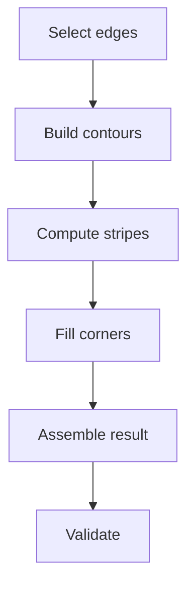

# Walkthrough: Fillets (solid edge blending)

This walkthrough makes OCCT fillets feel like a debuggable “local operation pipeline” rather than a single magic surface.

## What you should learn

- Why filleting is contour-based (chains of tangent edges).
- How to interpret `StripeStatus` as the primary error signal.
- Why “build done” and “result valid” are different checks.

## Read the oracle output (step-by-step)

Open `repros/lane-fillets/golden/fillets.json`:

1) Treat each case as a separate experiment
   - see the per-case expectations in `notes/walkthroughs/fillets-cases.md`

2) First check: did the builder produce a final shape
   - `cases.<case>.build.is_done`
   - If `is_done=false`, do not expect `Shape()` to be available.

3) Then localize failures to contours
   - `cases.<case>.build.contours[*].stripe_status_name`
   - `ChFiDS_StartsolFailure` is often “cannot start” (radius too big or impossible geometry)
   - `ChFiDS_WalkingFailure` is “failed while propagating” along the contour
   - `ChFiDS_TwistedSurface` often signals geometric degeneracy in the built surface

4) Partial result is a real mode
   - `cases.<case>.partial_result.has_bad_shape`
   - `cases.<case>.partial_result.bad_shape_bbox` and `bad_shape_counts` help you detect “holey” partial results.

5) Result sanity checks (when `is_done=true`)
   - `cases.<case>.result.is_valid` is `BRepCheck_Analyzer::IsValid()`
   - `cases.<case>.result.counts` and `cases.<case>.result.bbox` are fast regression checks
   - `cases.<case>.result.surface_types` is a quick “did we actually create blend faces” hint (cylindrical/toroidal or spline surfaces often appear)

## The pipeline model (mental picture)

For the code anchors behind these boxes:
- `notes/maps/hub-fillets.md`

## Failure triage playbook

When a fillet fails in “real work”, the fastest order is:

1) Check `is_done`
2) Check `stripe_status_name` per contour
3) Reduce radius and retry (start failures are often radius driven)
4) If working on imported or booleaned shapes, heal first (`notes/maps/hub-shape-healing-analysis.md`)
5) If you get a result but `is_valid=false`, suspect tiny edges and corner complexity
